# Cognito

### Persistent structured memory for Claude Code.

Every conversation you have with Claude — every decision, every debugging session, every architecture debate — disappears when the session ends. Six months of daily work, gone. You start over every time.

Cognito fixes this. It gives Claude a **local, structured knowledge base** on disk that it reads at session start and writes to throughout the session. No vector database, no cloud, no API calls. Just markdown files that Claude compiles, maintains, and queries — and that survive across sessions forever.

**It is Claude's own memory.** Claude reads it, writes it, maintains it, improves from it.

```
                  ┌─────────────────────────────────────────────────┐
 Session N        │  Wake up: read _identity + _facts + _wisdom +  │
 ─────────────>   │  _index (~700 tokens). Full project awareness.  │
                  │                                                 │
                  │  Work: read wing rooms on demand as topics      │
                  │  come up. Update pages in-place with new        │
                  │  decisions, architecture, tasks.                │
                  │                                                 │
                  │  Save: hooks auto-persist every 15 messages.    │
                  │  Diary captures process observations.           │
 <─────────────   │  Nothing is lost.                               │
 Session N+1      └─────────────────────────────────────────────────┘
```

---

## Lineage

This plugin synthesizes two ideas:

**Andrej Karpathy's [LLM Wiki](https://gist.github.com/karpathy/442a6bf555914893e9891c11519de94f)** — the insight that RAG re-derives knowledge from scratch on every query, while a compiled wiki accumulates and compounds. Cognito applies this: raw conversation is classified, compiled into structured pages, and updated in-place. Pages reflect current truth, not append-only history. Knowledge is created at write time, not rediscovered at read time.

**[MemPalace](https://github.com/MemPalace/mempalace)** — the spatial metaphor of wings, rooms, halls, and tunnels for organizing memory. Rather than a flat folder of notes, knowledge is organized by domain (wings) and topic (rooms), with cross-references (tunnels) connecting the same concept across domains. The closet/drawer pattern provides compressed summaries that point to detailed content.

The diary system — Claude's personal observation journal that consolidates into long-term behavioral wisdom — is original to this plugin.

---

## Install

### Option A: Local development (quick start)

```bash
git clone https://github.com/<your-username>/cognito.git
claude --plugin-dir ./cognito
```

### Option B: Persistent install

```bash
git clone https://github.com/<your-username>/cognito.git ~/cognito
claude plugin install --path ~/cognito
```

Now every `claude` session loads the plugin automatically. Verify with `/plugins`.

### Option C: From a marketplace

```bash
claude plugin marketplace add <marketplace-url>
claude plugin install cognito
```

### First run

Just start Claude Code in any project. The `wake` skill auto-triggers, detects there's no vault, runs the bootstrap, and asks a few setup questions. That's it — every future session starts with Claude already knowing your project.

---

## Architecture

### The knowledge flow

Cognito has two parallel compilation pipelines that both feed into session startup:

```
  COMPILE PIPELINE                         DIARY PIPELINE
  (Karpathy LLM Wiki)                     (long-term wisdom)

  ┌──────────────────┐                    ┌──────────────────┐
  │ Raw conversation │                    │ Diary observation│
  │ decisions, code  │                    │ patterns, flags  │
  └────────┬─────────┘                    └────────┬─────────┘
           │ classify + route                      │ daily entry
           ▼                                       ▼
  ┌──────────────────┐                    ┌──────────────────┐
  │ Wing room pages  │                    │ dailies/         │
  │ update in-place  │                    │ diary-YYYY-MM-DD │
  └────────┬─────────┘                    └────────┬─────────┘
           │ if critical fact                      │ appears 2+ times
           ▼                                       ▼
  ┌──────────────────┐                    ┌──────────────────┐
  │ Boot layers      │                    │ _wisdom.md       │
  │ _facts.md        │                    │ graduated pattern│
  └────────┬─────────┘                    └────────┬─────────┘
           │                                       │
           └──────────────┬────────────────────────┘
                          ▼
                 ┌─────────────────┐
                 │  NEXT SESSION   │
                 │  Wake-up: ~700t │
                 │  Full awareness │
                 └─────────────────┘
                          │
                   ┌──────┴──────┐
                   ▼             ▼
              Knowledge     Wisdom
              compounds     compounds
```

The left pipeline handles **project knowledge** — decisions, architecture, tasks. The right pipeline handles **process wisdom** — how the user works, recurring patterns, behavioral adaptation. Both load at session start. Both compound over time.

### Memory layers

| Layer | File | Budget | Loaded | Purpose |
|-------|------|--------|--------|---------|
| L0 | `_identity.md` | ~50 tok | Always | Who Claude is in this project |
| L1 | `_facts.md` | ~200 tok | Always | Critical project facts |
| L1.5 | `_wisdom.md` | ~150 tok | Always | Working patterns from diary |
| L2 | `_index.md` | ~300 tok | Always | Map of all wings and rooms |
| L3 | Wing/room pages | ~2000 tok ea. | On demand | Domain knowledge |
| L4 | Sessions + diary | Unlimited | Rarely | Raw history |

**Wake-up cost: ~700 tokens.** Claude gets full project awareness — team, stack, decisions, working patterns — without the user re-explaining anything.

### Visual representation

#### Core Data




#### Docs and Commmands



### Vault structure

```
memory/
├── _identity.md              # L0: project + role + owner
├── _facts.md                 # L1: critical facts (team, stack, blockers)
├── _wisdom.md                # L1.5: consolidated diary patterns
├── _index.md                 # L2: table of contents for all wings
├── _log.md                   # Append-only audit trail
│
├── wings/                    # One wing per domain
│   ├── api/
│   │   ├── _wing.md          # Wing summary (closet → points to rooms)
│   │   ├── decisions.md      # Choices + rationale + dates
│   │   ├── architecture.md   # System design, schemas, flows
│   │   ├── tasks.md          # Current work + backlog
│   │   ├── context.md        # Requirements, constraints, goals
│   │   ├── problems.md       # Known issues + pitfalls
│   │   └── discoveries.md    # Breakthroughs + lessons learned
│   └── frontend/
│       ├── _wing.md
│       └── ...
│
├── entities/                 # Cross-cutting: people, tools, concepts
│   ├── person-alice.md
│   └── tool-postgres.md
│
├── dailies/                  # Claude's personal diary
│   ├── diary-2026-04-12.md
│   └── diary-2026-04-11.md
│
├── sessions/                 # Compressed daily session summaries
│   └── 2026-04-12.md
│
└── _archive/                 # Archived old content (never truly deleted)
    ├── sessions/
    └── dailies/
```

### Spatial organization

```
  ┌─────────────────────────────────────────────────┐
  │  WING: api-service                              │
  │                                                 │
  │    ┌───────────┐  ──hall──  ┌───────────┐       │
  │    │ decisions │            │ problems  │       │
  │    └─────┬─────┘            └───────────┘       │
  │          │                                      │
  │    ┌─────┴─────┐   ┌───────────┐                │
  │    │  _wing.md │──▶│ room page │ (the drawer)   │
  │    │  (closet) │   │ full text │                │
  │    └───────────┘   └───────────┘                │
  └──────────┼──────────────────────────────────────┘
             │
           tunnel (cross-wing link: same topic, different domain)
             │
  ┌──────────┼──────────────────────────────────────┐
  │  WING: frontend                                 │
  │          │                                      │
  │    ┌─────┴─────┐  ──hall──  ┌───────────┐       │
  │    │ decisions │            │ context   │       │
  │    └───────────┘            └───────────┘       │
  └─────────────────────────────────────────────────┘
```

**Wings** — one per major domain (a service, a person, a project).
**Rooms** — topics within a wing (decisions, architecture, tasks, problems, discoveries, context).
**Halls** — connections between related rooms within the same wing.
**Tunnels** — cross-references connecting the same topic across different wings.
**Closets** — wing summaries that point to room pages (the drawers).

---

## Commands

| Command | Purpose |
|---------|---------|
| `/cognito:wake` | Load memory context at session start (auto-triggers) |
| `/cognito:remember <what>` | Persist a decision, fact, or observation |
| `/cognito:recall <query>` | Search for past knowledge |
| `/cognito:diary [entry]` | Write a process observation or consolidate wisdom |
| `/cognito:status` | Vault overview, stats, and health |
| `/cognito:lint` | Audit vault health, auto-fix safe issues |

---

## Hooks

The plugin includes two lifecycle hooks that make memory automatic:

**Stop hook** — fires after every Claude response. Counts messages and triggers a save checkpoint every 15 messages (configurable via `autoSaveInterval` in settings). Claude persists any unpersisted knowledge to the relevant wing/room pages.

**PreCompact hook** — fires before Claude Code compresses the context window. This is the emergency save — Claude persists everything it knows before the context shrinks. Nothing is lost to compaction.

---

## The diary system

The diary is the piece that makes Claude genuinely improve over time — not just remember facts, but adapt to how you work.

### What goes in the diary

```markdown
# Diary: 2026-04-12

## 14:30 — User interaction pattern
User changed auth approach for the third time. Not indecisiveness —
exploring the solution space. Present 2-3 options with tradeoffs next time.
→ pattern: exploratory-decision-making

## 16:15 — Codebase observation
Error handling inconsistent across API routes. Third time noticing this.
→ flag: error-handling-inconsistency

## 17:00 — Self-improvement
My initial architecture suggestions were too complex. User always simplifies.
→ improve: start-simpler
```

### How wisdom graduates

Diary entries tagged with `→ pattern:`, `→ flag:`, or `→ improve:` accumulate daily. When a pattern appears across 2+ different days, it gets consolidated into `_wisdom.md` — a compressed file loaded every session (~150 tokens) that changes how Claude actually behaves:

```markdown
# Wisdom
Updated: 2026-04-12

## Working patterns
- Decision style: exploratory — present options, not commitments
- Session rhythm: short focused bursts, one topic at a time
- Communication: concise, minimal questions, state assumptions

## Codebase patterns
- Error handling: inconsistent — flag when touching related code
- Webhooks: race-condition-prone — always add retry logic

## Self-corrections
- Architecture: start simpler than instinct suggests
- Explanations: lead with "what", user asks "why" when curious
```

This is the difference between a tool that remembers what you said and one that learns how you think.

---

## Storage modes

| `useLocalMemory` | Vault location | Use case |
|-------------------|-----------------|----------|
| `true` | `.claude/knowledge/cognito/` | Project-local, git-committable, shared with team |
| `false` (default) | `~/.claude/knowledge/cognito/<folder>-<hash>/` | Global, per-project isolation, private |

To switch modes, set `useLocalMemory` in the vault's `settings.json` (inside the cognito directory), or tell Claude "use local memory" during bootstrap. Run `cognito-bootstrap --local` to explicitly create a project-local vault.

For local mode, consider this `.gitignore` to keep personal content out of version control while sharing project knowledge:

```
# Keep structured knowledge, skip personal content
.claude/knowledge/cognito/dailies/
.claude/knowledge/cognito/sessions/
.claude/knowledge/cognito/_archive/
```

---

## Plugin structure

```
cognito/
├── .claude-plugin/
│   └── plugin.json               # Plugin manifest
├── skills/
│   ├── wake/SKILL.md      # Auto-load context at session start
│   ├── remember/SKILL.md         # Persist knowledge to wings
│   ├── recall/SKILL.md           # Search and retrieve
│   ├── diary/SKILL.md            # Personal observations + consolidation
│   ├── status/SKILL.md           # Vault overview
│   └── lint/SKILL.md             # Health audit + auto-fix
├── agents/
│   └── memory-agent.md           # Background maintenance subagent (Haiku)
├── hooks/
│   └── hooks.json                # Stop + PreCompact auto-save hooks
├── bin/
│   ├── cognito-bootstrap       # First-run vault creation
│   ├── cognito-ops             # Core operations (locate, search, lint, etc.)
│   └── cognito-autosave        # Hook script with interval counter
├── settings.json                 # Default plugin permissions
└── README.md
```

---

## Key principles

1. **Compile, don't append** — pages reflect current truth, rewritten in-place. If the database changes from MySQL to Postgres, the page says `DB: Postgres (migrated from MySQL, 2026-04-12)` — not an append at the bottom.

2. **~700 token wake-up** — full project awareness without re-explanation. Claude knows your team, stack, decisions, and working patterns before the first message.

3. **Read on demand** — wing rooms are loaded only when the conversation touches that topic. A session about the frontend never loads the API wing's architecture room.

4. **Zero dependencies** — pure markdown and bash. No Python packages, no vector database, no API calls, no internet. Works offline, works forever.

5. **Wisdom compounds** — daily diary observations consolidate into behavioral patterns. Claude doesn't just remember what you decided — it learns how you think.

---

## Requirements

- Claude Code (any recent version with plugin support)
- Bash (included on macOS, Linux, WSL)
- Python 3 (used only for JSON parsing in the bin scripts)

No API keys. No internet after install. Everything local.

---

## License

MIT

---

## Credits

Inspired by [Andrej Karpathy's LLM Wiki](https://gist.github.com/karpathy/442a6bf555914893e9891c11519de94f) and the [MemPalace](https://github.com/MemPalace/mempalace) project by Milla Jovovich and Ben Sigman. The diary/wisdom pipeline and Claude Code plugin packaging are original to this project.
